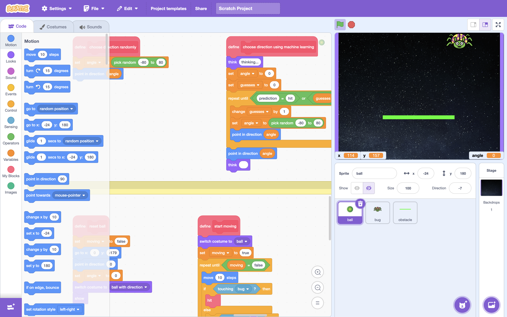
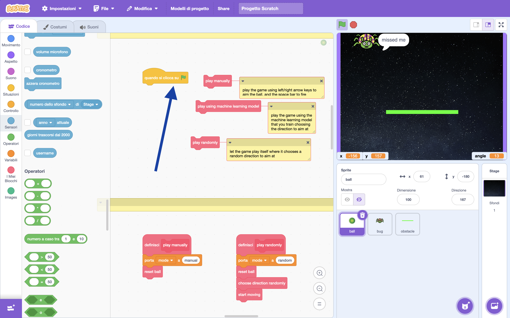
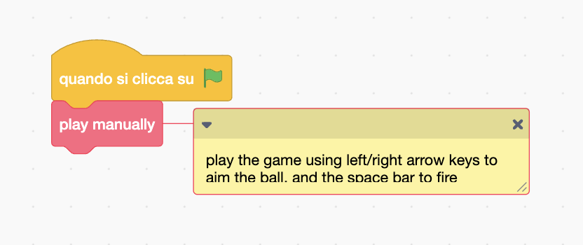
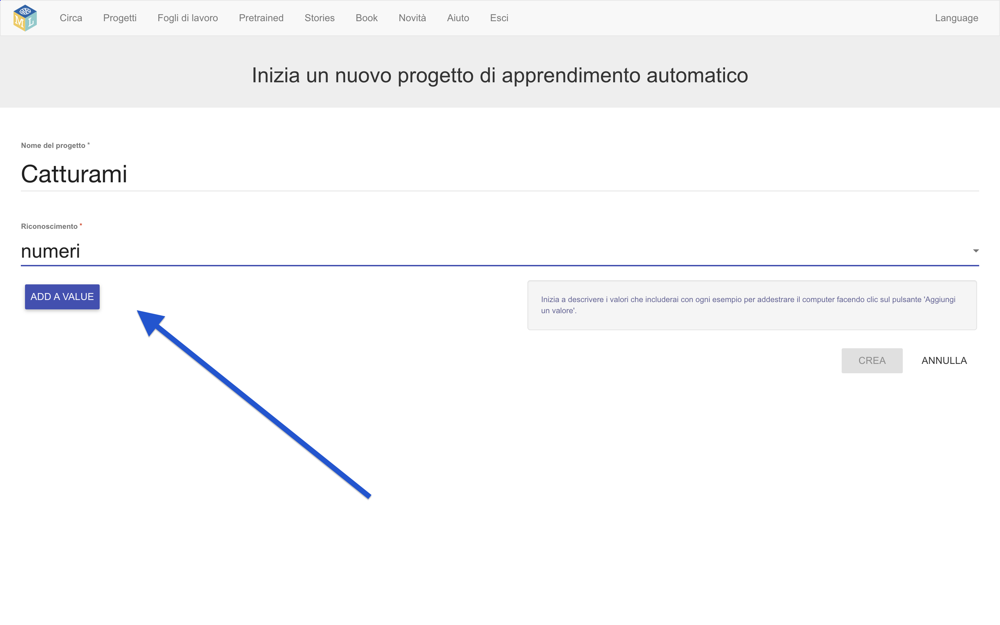
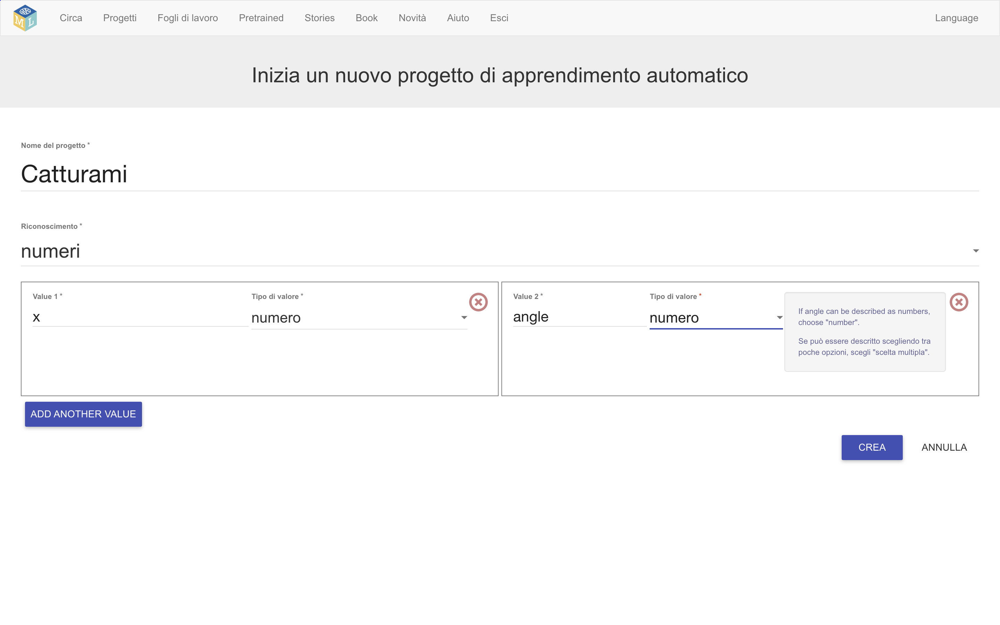
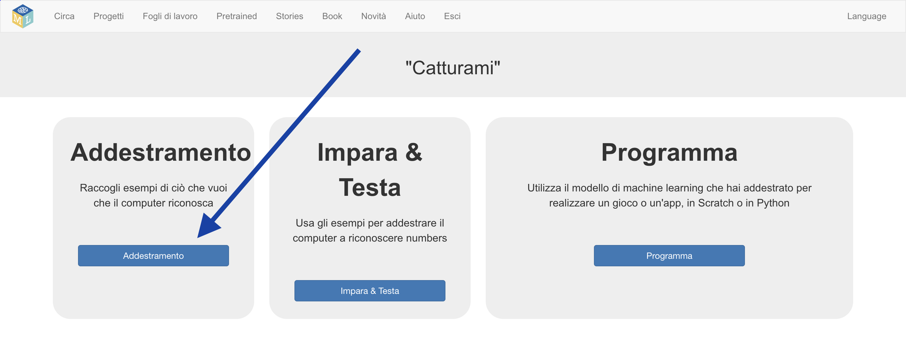

# Impara a programmare un gioco con Intelligenza Artificiale

## Obiettivo

Imparare i concetti di base del AI e della programmazione, creando un semplice gioco in Scratch.

## Materiale Necessario

- Un computer con accesso a Internet
- Accesso a [Scratch per Machine Learning 4 Kids](https://scratch.machinelearningforkids.co.uk/)

## Istruzioni

### Fase 1: Preparazione

1. **🌐 Andare sul sito**: Vai su `https://scratch.machinelearningforkids.co.uk`
2. **📑 Selezionare il Template**: Clicca su "Modelli di progetto" e poi su "Shoot the bug" (colpisci l'insetto).

### Fase 2: Familiarizzazione

1. **🕹️ Esplorare il Gioco**: Trova il blocco "quando viene cliccata la bandiera verde"  e attacca il blocco "play manually" (gioca manualmente). 
2. **🎮 Prova a Giocare**: Usa le frecce direzionali per mirare e premi la barra spaziatrice per sparare.

### Fase 3: Raccogliere Dati

1. **📝 Esempi**: Gioca diverse volte e prendi nota degli angoli e delle coordinate dove hai colpito o mancato l'insetto.

---

### Cosa hai fatto finora?

Fino a questo momento, hai giocato a un gioco in Scratch. Ogni volta che giochi, l'insetto si sposta in una posizione casuale. L'obiettivo del gioco è colpire l'insetto con una pallina.

Un ostacolo è presente, quindi è necessario far rimbalzare la pallina su una parete laterale per superarlo.

Le coordinate dell'insetto vengono visualizzate nell'angolo in basso a sinistra dello schermo del gioco, mentre l'angolo di lancio della pallina è mostrato nell'angolo in basso a destra.

In questo progetto, intenderai far decidere al computer sotto quale angolo tirare, in base alla posizione dell'insetto. 

Potresti farlo scrivendo del codice per calcolare l'angolo corretto di lancio, basandoti sulla posizione (potrai provarci a casa se vorrai).   
Tuttavia, per questo progetto, addestrerai il computer affinché impari autonomamente come tirare all'insetto. 

Raccoglierai esempi del gioco in azione e li utilizzerai per addestrare un "modello" che può prevedere se un tiro sotto un certo angolo andrà a segno o meno.

---

### Fase 4: Addestramento 

#### Parte 1: Inizializzazione

1. **🌐 Aprire il Browser**: Vai su `https://machinelearningforkids.co.uk/`. 
2. **🚀 Iniziare**: Clicca su "Iniziamo".
3. **👀 Prova Ora**: Clicca su "Prova subito".
4. **🆕 Nuovo Progetto**: Clicca sul pulsante "+ Aggiungi un nuovo progetto".
5. **📛 Nominare il Progetto**: Chiama il tuo progetto "Colpisci l'insetto" e impostalo per riconoscere "numeri".
6. **➕ Aggiungi un Valore**: Clicca su "Add a value". 
7. **🔠 Crea un Valore 'x'**: Crea un valore numerico chiamato "x", poi clicca su "Add another value".
8. **📐 Crea un Valore 'angle'**: Crea un valore numerico chiamato "angle".
9. **✅ Conferma**: Clicca sul pulsante "Crea". 
10. **🔍 Seleziona il Progetto**: "Colpisci l'insetto" verrà aggiunto alla tua lista di progetti. Clicca su di esso.
11. **🛠 Prepara le Predizioni**: Clicca sul pulsante "Addestramento". 
12. **🏷 Etichette**: Clicca su "+ Add new label" e chiamalo "hit". Ripeti l'azione, creando un secondo contenitore chiamato "miss". 

#### Parte 2: Implementazione in Scratch

1. **🔙 Torna al Progetto**: Clicca su "< Back to project" in alto a sinistra.
2. **🛠️ Avvia la Modalità di Costruzione**: Clicca su "Make".
3. **🔲 Scegli la Piattaforma**: Clicca su "Scratch 3".
4. **🔓 Accedi a Scratch**: Clicca su "straight into Scratch". 
5. **📄 Template di Progetto**: Clicca su "Project templates" e apri nuovamente il template "shoot the bug".
6. **⚙️ Configurazione Iniziale**: Connetti "play manually" al blocco "when Green Flag clicked", come hai fatto in precedenza. 
7. **🔍 Identifica gli Script**: Trova gli script per "hit" e "miss". 
8. **📈 Aggiungi Dati di Addestramento a 'Hit'**: Aggiungi un blocco "add training data" allo script "hit". 
9. **📉 Aggiungi Dati di Addestramento a 'Miss'**: Aggiungi un blocco "add training data" allo script "miss". 
10. **🎮 Test del Gioco**: Clicca sulla "Bandiera Verde" e gioca. Prova a colpire l'insetto! 
11. **🔄 Ritorna alla Piattaforma di ML**: Nella finestra del tuo altro browser ancora aperta sullo strumento di machine learning, clicca su "< Back to project" in alto a sinistra.
12. **🏋️ Addestramento del Modello**: Clicca su "Train". 

### Fase 5: Test e Miglioramento del Modello

1. **🔄 Ritorna a Scratch**: Gioca al gioco altre quattordici volte. Potrebbe essere più semplice giocare in modalità schermo intero.
2. **📊 Controlla gli Esempi di Addestramento**: Cerca di colpire più tiri possibili, ma non preoccuparti se ne manchi alcuni. 
3. **🔄 Aggiorna lo Script**: Modifica lo script "quando viene cliccata la bandiera verde" in modo che utilizzi "gioca in modo casuale" invece di "gioca manualmente". Questo renderà il campione di esempi più diversificato. 
4. **🚀 Raccogli Altri Esempi**: Clicca sulla Bandiera Verde per raccogliere altri esempi. Fai questo almeno altre trenta volte. 
5. **🔮 Utilizza il Modello di Apprendimento**: Modifica lo script "quando viene cliccata la bandiera verde" in modo che utilizzi "gioca usando il modello di machine learning" invece di "gioca in modo casuale". 
6. **🧠 Addestra un Nuovo Modello**: Aggiungi un blocco "addestra un nuovo modello di machine learning" allo script "quando viene cliccata la bandiera verde". 
7. **🔍 Trova lo Script di Scelta Direzione**: Trova lo script "scegli la direzione usando il machine learning". 
8. **🔄 Aggiorna lo Script per Utilizzare il Tuo Modello**: Modifica lo script per utilizzare il tuo modello di machine learning. 
9. **🕵️ Valuta l'Efficacia del Tuo Modello**: Clicca nuovamente sulla Bandiera Verde. Quanto è efficace il tuo modello di machine learning nel scegliere gli angoli che colpiranno l'insetto?

---

### Cosa hai fatto finora?

Hai iniziato ad addestrare un computer per giocare a un gioco. Invece di scrivere regole per farlo o calcolare l'equazione per determinare l'angolo di lancio del proiettile, lo stai facendo raccogliendo esempi. Questi esempi sono utilizzati per addestrare una Intelligenza Artificiale.

Il computer imparerà dai pattern negli esempi. Utilizzerà questi per fare previsioni se una posizione e un angolo porteranno a un colpo andato a segno o a un errore.

Poiché hai ancora i blocchi "aggiungi dati di addestramento" nel tuo script, stai ancora raccogliendo ulteriori esempi di addestramento ogni volta che giochi. Questo significa che più tempo permetterai al tuo modello di Intelligenza Artificiale di giocare al gioco, più diventerà abile nel farlo.

---

### Fase 6: Comprensione del Comportamento del Modello di Apprendimento Automatico

> **Nota**: Questa sezione è facoltativa per i bambini sotto i 9 anni poiché richiede una conoscenza più profonda dei concetti di coordinata e angolo.

1. **📊 Analisi degli Errori del Modello**: Quante volte il tuo modello di apprendimento automatico sta sbagliando? Se sbaglia troppo spesso, potrebbe essere perché non hai fornito abbastanza esempi di colpi andati a segno. Cambia il gioco in modalità "gioca manualmente" e usa nuovamente i tasti freccia. Raccogli altri dieci esempi di "colpo a segno". Poi torna alla modalità "gioca usando il modello di apprendimento automatico" e verifica se ciò ha sortito effetto.

2. **🎯 Raccolta di Esempi di Addestramento**: Continua a raccogliere esempi di addestramento fino a quando il tuo modello di apprendimento automatico non inizia a migliorare nel gioco. Quanti esempi ha richiesto il tuo modello? 

3. **🔄 Navigazione al Progetto**: Fai clic sul collegamento "< Back to project".

4. **📚 Apprendimento e Test**: Fai clic su "Learn & Test". 

5. **🔍 Descrizione del Modello**: Fai clic su "Describe your model". Questa pagina ti mostrerà un'immagine del tuo modello di apprendimento automatico. Leggi la pagina per capire cosa significa. Prova a inserire valori per la coordinata x del bug e un angolo di tiro, poi fai clic su Test per vedere come il tuo modello di apprendimento automatico fa una previsione su cosa accadrà. 

6. **🔮 Verifica delle Previsioni**: Utilizza questa visualizzazione e il gioco in Scratch in modalità "gioca manualmente" per vedere quali previsioni sta facendo il tuo modello di apprendimento automatico e se sono corrette.

---

### Cosa Hai Fatto Finora?

In questa fase, hai addestrato un modello di apprendimento automatico noto come "albero decisionale classificatore" (*decision tree classifier*). La visualizzazione ti consente di comprendere come il tuo modello effettua previsioni. È un modo efficace per osservare quali schemi il computer ha individuato nei dati di addestramento che hai raccolto.

---

### È un Buon Utilizzo dell'Apprendimento Automatico?

 
Riflettiamo sulle applicazioni appropriate dell'apprendimento automatico. Utilizziamo questa tecnologia quando desideriamo che i computer eseguano compiti troppo complicati per essere descritti da istruzioni esplicite.

Evitiamo l'apprendimento automatico quando il tempo necessario per raccogliere esempi di addestramento supera quello per scrivere direttamente le istruzioni per il compito.

Confronta lo sforzo impiegato per raccogliere gli esempi di addestramento con lo sforzo che avrebbe richiesto calcolare l'angolo di tiro. Pensi che questo gioco sia un buon uso dell'apprendimento automatico?

E se il gioco fosse reso più difficile? Ad esempio, se ci fossero più ostacoli o se l'insetto potesse apparire a diverse altezze? Queste complicazioni renderebbero le equazioni per calcolare l'angolo di tiro molto più intricate.

Questo renderebbe l'apprendimento automatico un'opzione più conveniente per gestire il gioco, sebbene richiederebbe probabilmente più esempi di addestramento data la maggiore complessità del compito.

(Puoi provare a casa a implementare questi miglioramenti e vedere di persona se questo è il caso!)

---

### Idee e Estensioni

Ora che hai completato il progetto, perché non provare una di queste idee, o magari inventarne una di tua iniziativa?

#### Aggiungi Ostacoli Supplementari

Rendi il gioco più impegnativo inserendo ulteriori ostacoli sullo schermo di gioco. Dovrai aggiornare lo script "start moving" in modo che la palla sappia da quali nuovi ostacoli rimbalzare.

#### Utilizza le Coordinate x e y

Per ridurre la quantità di addestramento necessario, abbiamo utilizzato solo una coordinata (coordinata x) permettendo all'insetto di muoversi solo da sinistra a destra. Prova a rifare il progetto consentendo all'insetto di spostarsi anche in altezza (posizione y). Dovrai aggiungere un nuovo valore numerico per memorizzare queste coordinate y quando crei il progetto di apprendimento automatico.

#### Rendilo Competitivo!

Prova ad aggiungere una variabile per tenere il punteggio e vedere se il tuo modello di apprendimento automatico può ottenere un punteggio più alto del tuo.

---

### Licenza

Questo foglio di progetto è distribuito sotto licenza "Creative Commons Attribution Non-Commercial Share-Alike" ([CC BY-NC-SA 4.0](http://creativecommons.org/licenses/by-nc-sa/4.0/)).

